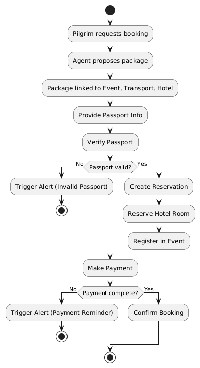
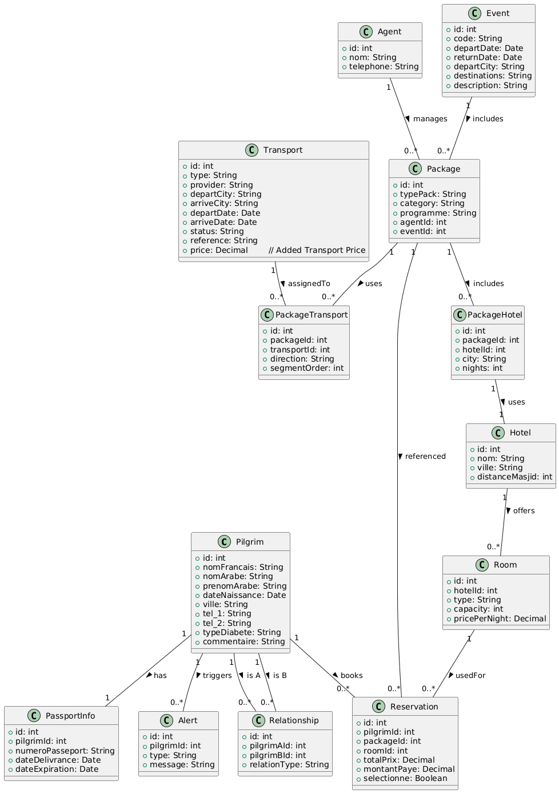

# Umrah Voyage

<p align="center">
    
</p>

## About The Project

**Umrah Voyage** is a comprehensive management system for travel agencies specializing in Umrah pilgrimages. It streamlines the process of managing pilgrims, bookings, packages, and logistics, ensuring a smooth experience for both the agency and the pilgrims.

---

## 📊 System Diagrams

### Activity Diagram


### Class Diagram


### Sequence Diagram


---

## ✨ Key Features

- **Pilgrim Management**: Detailed profiles, passport info, and family relationships.
- **Package Management**: Create/manage packages linked to events, hotels, and transport.
- **Booking System**: Reservation system for pilgrims, room allocation, and event registration.
- **Logistics**: Manage hotels, rooms, and transport providers.
- **Alert System**: Automated alerts for passport expiry, payment reminders, and more.
- **Admin Dashboard**: Built with [Filament](https://filamentphp.com/) for a modern, customizable admin experience.

---

## 🛠️ Technology Stack

- **Framework**: Laravel 12
- **Admin Panel**: Filament 3
- **Frontend**: TailwindCSS 4
- **Build Tool**: Vite
- **Database**: PostgreSQL

---

## 🚀 Getting Started


### Prerequisites

- PHP ^8.2 (Tested with PHP 8.4.14)
- Composer (Tested with Composer 2.9.0)
- Node.js & NPM
- PostgreSQL

> Example environment:
> ```
> Microsoft Corporation. All rights reserved.
> 
> C:\Users\Sekeru>composer --version
> Composer version 2.9.0 2025-11-13 10:37:16
> PHP version 8.4.14 (C:\php\php.exe)
> Run the "diagnose" command to get more detailed diagnostics output.
> 
> C:\Users\Sekeru>
> ```

### Installation Steps

1. **Clone the repository**
    ```bash
    git clone https://github.com/shi-nto/wb--umrah.voyage.git
    cd wb--umrah.voyage
    ```
2. **Install PHP dependencies**
    ```bash
    composer install
    ```
3. **Install JavaScript dependencies**
    ```bash
    npm install
    ```
4. **Environment Setup**
   
    Edit `.env` for your DB settings:
    ```env
    DB_CONNECTION=pgsql
    DB_HOST=127.0.0.1
    DB_PORT=5432
    DB_DATABASE=umrah_voyage
    DB_USERNAME=postgres
    DB_PASSWORD=your_password
    ```
5. **Generate Application Key**
    ```bash
    php artisan key:generate
    ```
6. **Database Migration & Seeding**
    ```bash
    php artisan migrate --seed
    ```
    *Seeds initial data: pilgrims, agents, events, hotels, transport, packages, reservations.*
7. **Build Assets**
    ```bash
    npm run build
    ```


8. **Storage & images**

- Place your uploaded images under `storage/app/public/images` (e.g. `storage/app/public/images/logo.png`). Filament's `asset('storage/images/...')` expects files to be served from `public/storage/images` via the storage symlink.
- Create the storage symlink (run this once):
    ```powershell
    php artisan storage:link
    ```

    If you have local images in `storage/app/images` and want to copy the `logo.png` into the publicly served folder, run (PowerShell):
    ```powershell
    mkdir \storage\app\public\images\
    ```
   
    ```powershell
   cp .\storage\images\logo.png .\storage\app\public\images
    ```

- Images in `storage/app/public/images` and `public/storage/images` will be tracked and pushed to the repository by default. No special git configuration is needed.

9. **Run the Application (Development Mode)**
    In two separate terminals, run:
    ```bash
    npm run dev
    ```
    and
    ```bash
    php artisan serve
    ```
  

    Filament admin panel is available at: [http://localhost:8000/admin](http://localhost:8000/admin)

---


## 👤 Default Credentials

> **Admin**
> - Email: `admin@umrah.com`
> - Password: `password`

> **Agent**
> - Email: `agent@gmail.com`
> - Password: `agent123`

*You can change these credentials after login.*

### Re-seed / Verify admin (development)

After updating the seeder, run the following to re-seed the admin user:

```powershell
php artisan db:seed --class=Database\\Seeders\\AdminUserSeeder
```

To verify the admin exists, run:

```powershell
php artisan tinker
>>> \App\\Models\\User::where('email', 'admin@umrah.com')->first();
```

---

## 🤝 Contributing

Contributions are welcome! Please submit a Pull Request.

---

## 📄 License

This project is open-sourced under the [MIT license](https://opensource.org/licenses/MIT).
